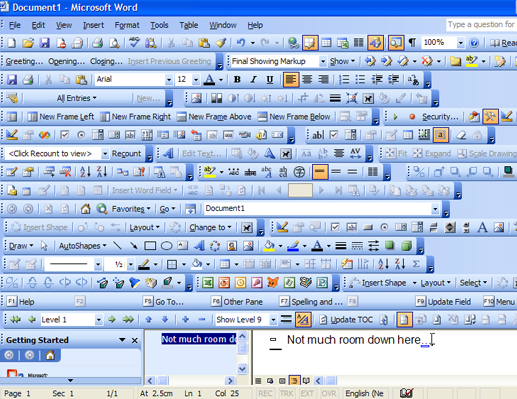

# Extra Feature

For your application, you now get to take some control of the direction of the project. Most teams may opt to implement different features, but the only requirement is that your project has something to do with 'sharing' whatever that means.

You are certainly welcome to add more features, but be careful given the tight project timeline! Adding too many featuers can sometimes lead to something called [feature creep](https://en.wikipedia.org/wiki/Feature_creep), where you add many features to appease your client, but they may not actually need many features, only 1 or 2 that work really well!

## Feature List

Below is a prospective list of features which you may choose from to add. Decide as a group which feature you would like to add.

- Suggested 'sharing' releated features that may spark some interest.
	- Real-time Sound or Video for chatting
	- A file compression algorithm for saving something and sending to someone else
 	- Perhaps users can draw interactively in Husky Town	 
	- Perhaps users can interact with your application on another device to 'share' in the experience (e.g. Write an android application in D that connects with desktop application)
   	- Perhaps there is a game in Husky Town.
   	- Perhaps there is a way to 'build something' collaboratively.
	- Any other features you otherwise would like to propose, which must go through your project manager (See F.A.Q)

### Feature Use Case

Your next task is the following.

1. Make sure your 'sharing' feature to your project timeline
2. Add the feature to the 'Projects' task list in Github. You may break it down into further sub tasks as needed.
3. Begin implementing the feature.
	- You must also implement at least 1 test case for your feature to ensure that it works.

# F.A.Q. (Instructor Anticipated Questions)

1. Q: If I choose a really easy feature will I get less points?
	- A: Not necessarily, and I think each feature has it's own challenge?
2. Q: If I implement 2 or more features will I get more points?
	- A: I would encourage that, maybe! But 1 good feature that works is better than 2 features which almost work.
3. Q: Can I propose another feautre?
  	- A: Sure, do so with your project manager and they will approve it based on if they think it can be completed by the project deadline.

